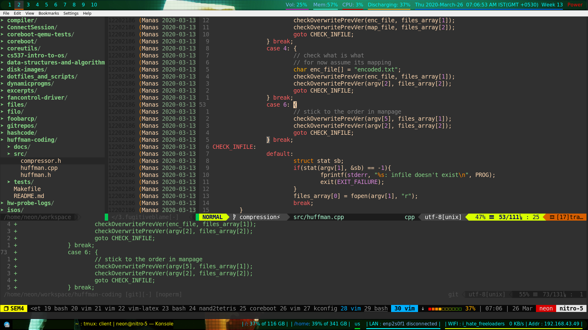

# dotfiles_and_scripts
My personal dotfiles and scripts (will be kept updated in future)

### Images
> Vim Configuration

#### Useful tips
1. Inside vimrc, there is a function Skel() which controls the working of
templates only in certain directories. For e.g., in my case, I wanted to read
a template code for competitive programming whenever I opened a new buffer in
vim. And this should work only in certain directories which I have coded in 
augroup templates.

2. On GitHub, you will not see the unicode characters used in Airline conf.
What you should do is to read those characters from Airline's docs.

